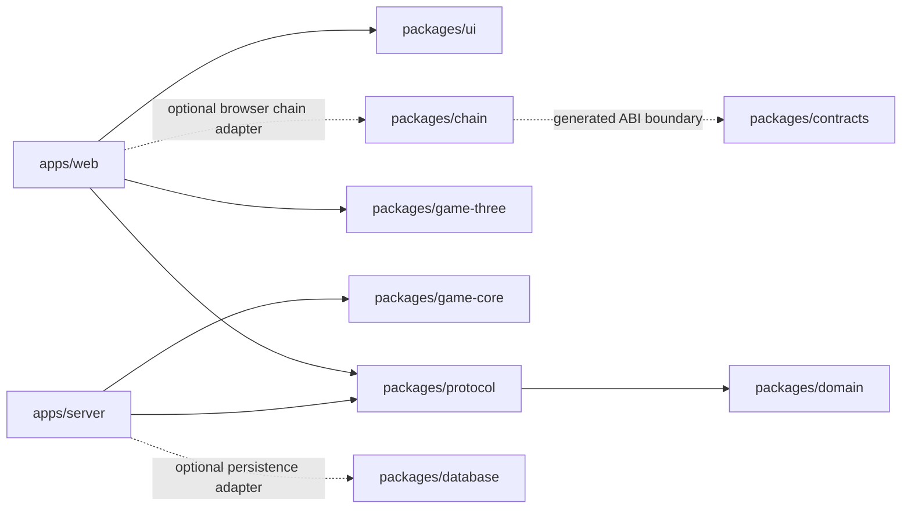

# Architecture

This repository is a modular TypeScript runtime for interactive, realtime, spatial, and Ethereum-capable software. Its package graph is designed for selective agent context: each package has one job, a small public surface, and machine-checked dependency rules.

The solid arrows are current imports and point from consumers to dependencies. Dotted arrows are prepared capability seams, not hidden runtime dependencies. `domain`, `protocol`, `game-core`, and `game-three` never depend on an app. `game-core` never depends on Effect, React, Three, or a host runtime, so the same simulation can run in the Bun server, a browser worker, a replay runner, or a headless test.

## The three state rates

1. The authoritative simulation advances on a fixed 20 Hz timestep.
2. Realtime snapshots cross a versioned Effect Schema protocol at 20 Hz.
3. The renderer interpolates toward the latest snapshot at display refresh rate without routing transforms through React state.

Application UI state may use React or Effect Atom when a feature needs it. Persistent application data belongs in Postgres/Drizzle. Neither database synchronization nor React state belongs in the simulation tick.

## Identifiers

Entity identifiers are TypeIDs — prefixed, UUIDv7-backed, sortable strings declared once in `packages/domain/src/id.ts`. A single declaration yields the Effect Schema used on the wire, the branded type, the Drizzle column default, and the UUID conversion, so an identifier cannot mean one thing in transport and another in storage. `docs/decisions/0002-typeid-identifiers.md` records why.

## Capability boundaries

- HTTP and WebSocket are transport adapters around shared contracts. Effect owns their lifecycle, errors, retry policy, and configuration.
- shadcn/Base UI is source-owned DOM UI. Three/R3F is a renderer. The app composition root passes CSS-derived scene tokens into Three; in-canvas UI is intentionally absent from the core.
- Foundry is the Solidity toolchain. `packages/chain` is the typed application boundary. Browser writes go through wagmi; server reads use viem inside Effect services.
- Colyseus, Rapier, WebGPU/TSL, local-first sync, Durable Objects, auth, and a specific database host are later adapters. Their absence keeps the initial core honest.

## Adding a package

Add a workspace only when it owns a stable boundary or independently testable capability. A directory that merely splits types, constants, helpers, or one implementation adds context cost without architectural value. Update `tools/check-boundaries.ts` when a new package creates a dependency rule worth enforcing.
